# Android Kotlin
This repo contains the programming assignments that I have done part of the course [Android Basics with Compose](https://developer.android.com/courses/android-basics-compose/course) by Google. 

---

### ReadMe:
1. Click on the 'App Name' in the following table to view the source code for which project. 
2. To run, clone the repo using the command either of the following commands:
    ```
    git clone git@github.com:jjose14-Jacob-Jose/kotlin-google-tutorial.git
    git clone https://github.com/jjose14-Jacob-Jose/kotlin-google-tutorial.git
    ```
3. You can also download the [zip](https://github.com/jjose14-Jacob-Jose/kotlin-google-tutorial/archive/refs/heads/main.zip) file.
4. Once downloaded/cloned open the corresponding app's folder in [Android Studio](https://developer.android.com/studio) and you can run it. 
5. [Click here](https://developer.android.com/studio/run/managing-avds) for instruction on how to configure a virtual device in Android Studio.

---

#### Disclaimer:
- App may crash if you try to upgrade the Gradle version using Android Studio.
- Some of source is copied from Google's training website. 

---

### Advanced functionality apps:
| App Name                                                                                        | Description                                                                                                                                                                                     | Screenshot                                                                                 | Google Tutorial URL                                                                                                                                                                                                                                                                                                                                                                                                                                                                              |
|-------------------------------------------------------------------------------------------------|-------------------------------------------------------------------------------------------------------------------------------------------------------------------------------------------------|--------------------------------------------------------------------------------------------|--------------------------------------------------------------------------------------------------------------------------------------------------------------------------------------------------------------------------------------------------------------------------------------------------------------------------------------------------------------------------------------------------------------------------------------------------------------------------------------------------|
| [Art Space](courses/5-interacting_with_ui_and_state/2-art_space)                                | Images application, where images can be cycle using buttons. Responsible UI.                                                                                                                    | 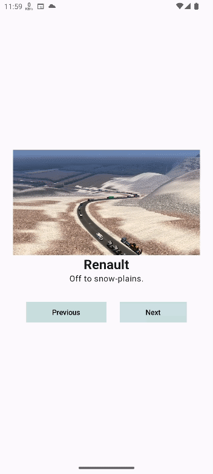                            | [Google Tutorial](https://developer.android.com/codelabs/basic-android-kotlin-compose-art-space?continue=https%3A%2F%2Fdeveloper.android.com%2Fcourses%2Fpathways%2Fandroid-basics-compose-unit-2-pathway-3%23codelab-https%3A%2F%2Fdeveloper.android.com%2Fcodelabs%2Fbasic-android-kotlin-compose-art-space#3)                                                                                                                                                                                 |
| [Tip Calculator](courses/5-interacting_with_ui_and_state/1-tip_calculator)                      | Calculates the tip based on specific percentage. Also has option to round-up the tip.                                                                                                           |                       | [Video Overview](https://www.youtube.com/watch?v=Rivh4abaYzg)                                                                                                                                                                                                                                                                                                                                                                                                                                    |
| [Woof Dogs](courses/6-unit_3-display_lists_and_use_material_design/4-woof)                      | Dog profiles with an about section that loads by animation.  Has Dark and Light modes.                                                                                                          | 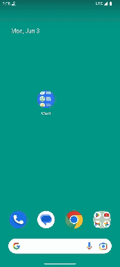                            | [Google Tutorial](https://developer.android.com/codelabs/basic-android-kotlin-compose-material-theming?continue=https%3A%2F%2Fdeveloper.android.com%2Fcourses%2Fpathways%2Fandroid-basics-compose-unit-3-pathway-3%23codelab-https%3A%2F%2Fdeveloper.android.com%2Fcodelabs%2Fbasic-android-kotlin-compose-material-theming#1)                                                                                                                                         |
| [Lemonade (Cycle)](courses/4-add_a_button_to_an_app/2-lemonade)                                 | Shows the cycle of a lemonade - from lemon tree to empty glass. Interactive by taps.                                                                                                            | 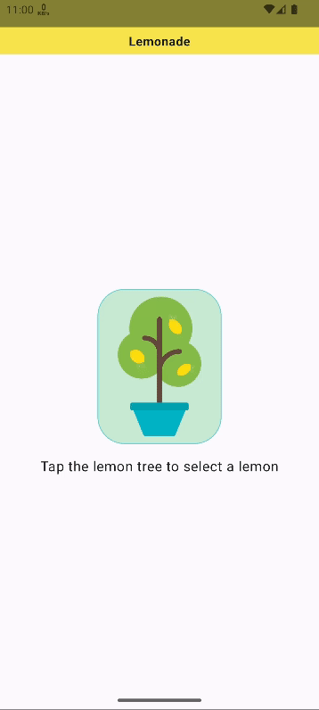                                | [Google Tutorial](https://developer.android.com/codelabs/basic-android-kotlin-compose-button-click-practice-problem?continue=https%3A%2F%2Fdeveloper.android.com%2Fcourses%2Fpathways%2Fandroid-basics-compose-unit-2-pathway-2%23codelab-https%3A%2F%2Fdeveloper.android.com%2Fcodelabs%2Fbasic-android-kotlin-compose-button-click-practice-problem#1)                                                                                                                                         |
| [Dice Roller](courses/4-add_a_button_to_an_app/1-dice_roller)                                   | Virtual dice for board games.                                                                                                                                                                   | 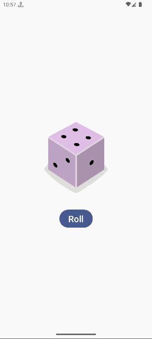                                 | [Google Tutorial](https://developer.android.com/codelabs/basic-android-kotlin-compose-build-a-dice-roller-app?continue=https%3A%2F%2Fdeveloper.android.com%2Fcourses%2Fpathways%2Fandroid-basics-compose-unit-2-pathway-2%23codelab-https%3A%2F%2Fdeveloper.android.com%2Fcodelabs%2Fbasic-android-kotlin-compose-build-a-dice-roller-app#0)                                                                                                                                                     |
| [Countries with GraphQL](https://github.com/jjose14-Jacob-Jose/GraphQlCountriesApp)*            | App interacting with a GraphQL API to retrieve a list of countries and for each country its name, capital, currency, and languages.  ***`This is not part of Google Android Kotlin Tutorial.`** |  | [Philipp Lackner - YouTube](https://www.youtube.com/watch?v=ME3LH2bib3g)                                                                                                                                                                        |

---

### Basic functionality apps:
| App Name                                                                                        | Description                                                                                                                                                                                     | Screenshot                                                                                 | Google Tutorial URL                                                                                                                                                                                                                                                                                                                                                                                                                                                                             |
|-------------------------------------------------------------------------------------------------|-------------------------------------------------------------------------------------------------------------------------------------------------------------------------------------------------|--------------------------------------------------------------------------------------------|-------------------------------------------------------------------------------------------------------------------------------------------------------------------------------------------------------------------------------------------------------------------------------------------------------------------------------------------------------------------------------------------------------------------------------------------------------------------------------------------------|
| [Superheroes](courses/6-unit_3-display_lists_and_use_material_design/5-superheroes)                    | Superheroes list. Supports Dark and Light modes.                                                                                                                                                | 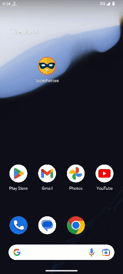                                | [Google Tutorial](https://developer.android.com/codelabs/basic-android-kotlin-compose-practice-superheroes?continue=https%3A%2F%2Fdeveloper.android.com%2Fcourses%2Fpathways%2Fandroid-basics-compose-unit-3-pathway-3%23codelab-https%3A%2F%2Fdeveloper.android.com%2Fcodelabs%2Fbasic-android-kotlin-compose-practice-superheroes#0)                                                                                                                                         |
| [Affirmation Quotes](courses/6-unit_3-display_lists_and_use_material_design/2-affirmations_app) | Affirmation quotes with inspiring pictures.                                                                                                                                                     |                            | [Google Tutorial](https://developer.android.com/codelabs/basic-android-kotlin-compose-training-add-scrollable-list?continue=https%3A%2F%2Fdeveloper.android.com%2Fcourses%2Fpathways%2Fandroid-basics-compose-unit-3-pathway-2%23codelab-https%3A%2F%2Fdeveloper.android.com%2Fcodelabs%2Fbasic-android-kotlin-compose-training-add-scrollable-list#0)  --  [Google's GitHub Repo](https://github.com/google-developer-training/basic-android-kotlin-compose-training-affirmations/tree/starter) |
| [Courses](courses/6-unit_3-display_lists_and_use_material_design/3-courses)                     | 2-column scrollable grid showing coures available.                                                                                                                                              |                                | [Philipp Lackner - YouTube](https://developer.android.com/codelabs/basic-android-kotlin-compose-practice-grid?continue=https%3A%2F%2Fdeveloper.android.com%2Fcourses%2Fpathways%2Fandroid-basics-compose-unit-3-pathway-2%23codelab-https%3A%2F%2Fdeveloper.android.com%2Fcodelabs%2Fbasic-android-kotlin-compose-practice-grid#0)                                                                                                                                                              |
| [Business Card](courses/2-build_a_basic_layout/5-business_card)                                 | Business card with your logo, name, and contact information.                                                                                                                                    | 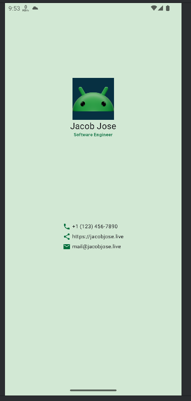                                   | [Google Tutorial](https://developer.android.com/codelabs/basic-android-kotlin-compose-business-card?continue=https%3A%2F%2Fdeveloper.android.com%2Fcourses%2Fpathways%2Fandroid-basics-compose-unit-1-pathway-3%23codelab-https%3A%2F%2Fdeveloper.android.com%2Fcodelabs%2Fbasic-android-kotlin-compose-business-card#0)                                                                                                                                                                        |
| [Compose Article](courses/2-build_a_basic_layout/2-compose_preview)                             | App showing an article about 'Jetpack Compose tutorial' with header image, title, and description.                                                                                              | 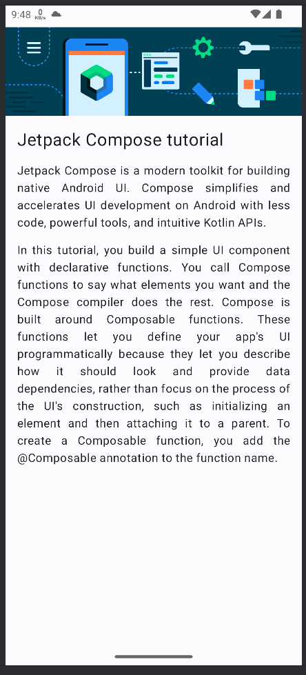           | [Google Tutorial](https://developer.android.com/codelabs/basic-android-kotlin-compose-composables-practice-problems?continue=https%3A%2F%2Fdeveloper.android.com%2Fcourses%2Fpathways%2Fandroid-basics-compose-unit-1-pathway-3%23codelab-https%3A%2F%2Fdeveloper.android.com%2Fcodelabs%2Fbasic-android-kotlin-compose-composables-practice-problems#1)                                                                                                                                        |
| [Compose Quadrants](courses/2-build_a_basic_layout/4-compose_quadrant)                          | 4 quadrants with different titles, description, and background colors.                                                                                                                          | 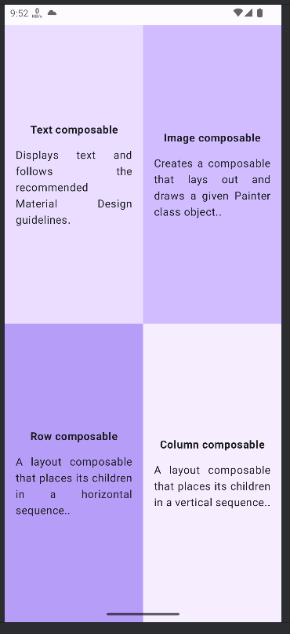                           | [Google Tutorial](https://developer.android.com/codelabs/basic-android-kotlin-compose-business-card?continue=https%3A%2F%2Fdeveloper.android.com%2Fcourses%2Fpathways%2Fandroid-basics-compose-unit-1-pathway-3%23codelab-https%3A%2F%2Fdeveloper.android.com%2Fcodelabs%2Fbasic-android-kotlin-compose-business-card#0)                                                                                                                                                                        |
| [Tasks Completed Greeting](courses/2-build_a_basic_layout/3-task_manager)                       | App showing 'Task completed' message with a checkmark logo.                                                                                                                                     | 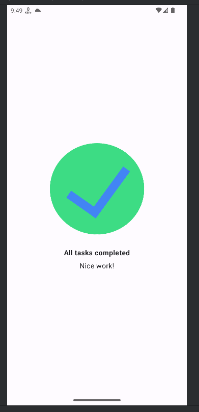                      | [Google Tutorial](https://developer.android.com/codelabs/basic-android-kotlin-compose-composables-practice-problems?continue=https%3A%2F%2Fdeveloper.android.com%2Fcourses%2Fpathways%2Fandroid-basics-compose-unit-1-pathway-3%23codelab-https%3A%2F%2Fdeveloper.android.com%2Fcodelabs%2Fbasic-android-kotlin-compose-composables-practice-problems#2)                                                                                                                                        |
| [Birthday Card App](courses/2-build_a_basic_layout/1-birthday_card)                             | App that greets you 'happy birthday' with your name.                                                                                                                                            | 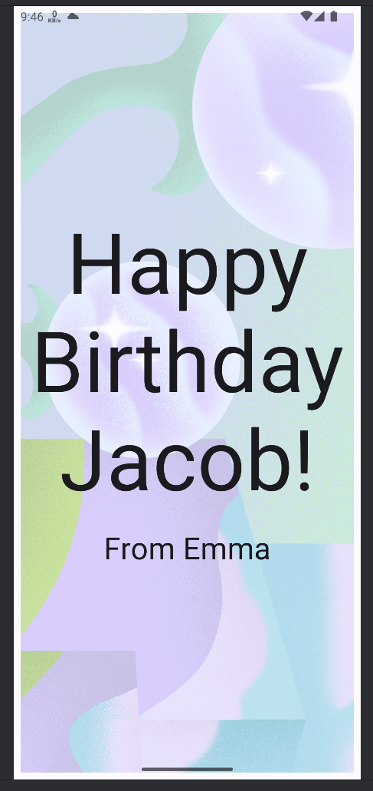                | [Google Tutorial](https://developer.android.com/codelabs/basic-android-kotlin-compose-text-composables?continue=https%3A%2F%2Fdeveloper.android.com%2Fcourses%2Fpathways%2Fandroid-basics-compose-unit-1-pathway-3%23codelab-https%3A%2F%2Fdeveloper.android.com%2Fcodelabs%2Fbasic-android-kotlin-compose-text-composables#8)                                                                                                                                                                  |
| [Setup Android Studio](courses/1-setup_android_studio)                                          | Basic Android application in boilerplate code.                                                                                                                                                  | 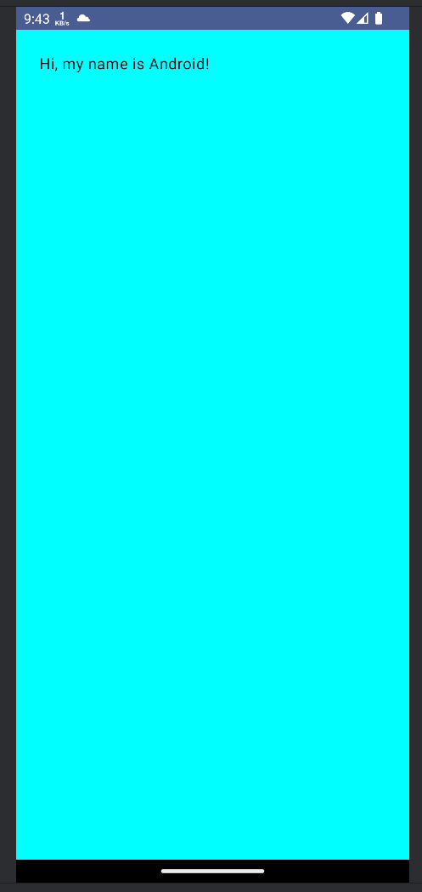                        | [Google Tutorial ](https://developer.android.com/codelabs/basic-android-kotlin-compose-emulator?continue=https%3A%2F%2Fdeveloper.android.com%2Fcourses%2Fpathways%2Fandroid-basics-compose-unit-1-pathway-2%23codelab-https%3A%2F%2Fdeveloper.android.com%2Fcodelabs%2Fbasic-android-kotlin-compose-emulator#2)                                                                                                                                                                                 |

---
