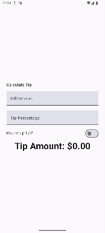
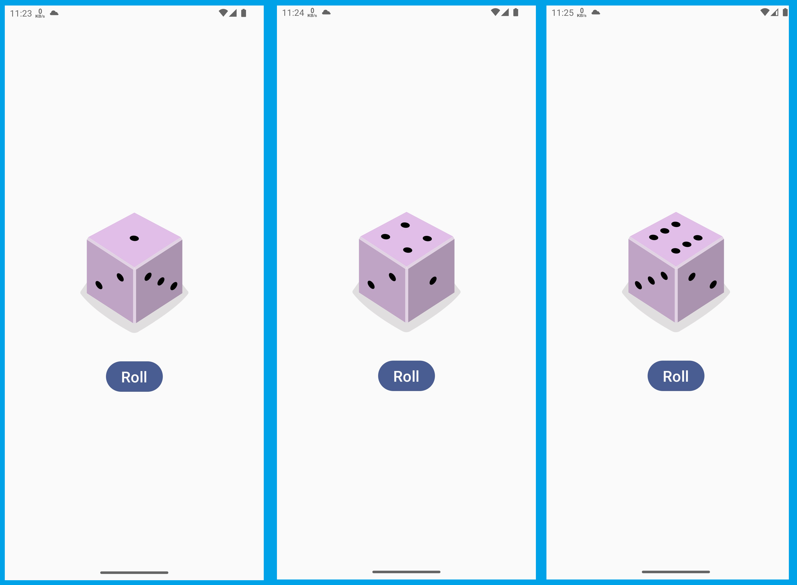

# kotlin-google-tutorial
This repo contains the programming assignments that I have done part of the course [Android Basics with Compose](https://developer.android.com/courses/android-basics-compose/course) by Google. 

## Repository Structure:
You can find the different projects that I have done, inside the '[courses](courses)' folder. 

| App Name                                                                                                                                                                                                                                                                                                   | Description                                                                                        | Screenshot                                                                        | Google Tutorial URL                                                                                                                                                                                                                                                                                                                                      |
|------------------------------------------------------------------------------------------------------------------------------------------------------------------------------------------------------------------------------------------------------------------------------------------------------------|----------------------------------------------------------------------------------------------------|-----------------------------------------------------------------------------------|----------------------------------------------------------------------------------------------------------------------------------------------------------------------------------------------------------------------------------------------------------------------------------------------------------------------------------------------------------|
| [Art Space](https://developer.android.com/codelabs/basic-android-kotlin-compose-art-space?continue=https%3A%2F%2Fdeveloper.android.com%2Fcourses%2Fpathways%2Fandroid-basics-compose-unit-2-pathway-3%23codelab-https%3A%2F%2Fdeveloper.android.com%2Fcodelabs%2Fbasic-android-kotlin-compose-art-space#3) | Images application, where images can be cycle using buttons. Responsible UI.                       |                      | [Google Tutorial](https://developer.android.com/codelabs/basic-android-kotlin-compose-art-space?continue=https%3A%2F%2Fdeveloper.android.com%2Fcourses%2Fpathways%2Fandroid-basics-compose-unit-2-pathway-3%23codelab-https%3A%2F%2Fdeveloper.android.com%2Fcodelabs%2Fbasic-android-kotlin-compose-art-space#3)                                         |
| [Tip Calculator](courses/5-interacting_with_ui_and_state/1-tip_calculator)                                                                                                                                                                                                                                 | Calculates the tip based on specific percentage. Also has option to round-up the tip.              |                | [Video Overview](https://www.youtube.com/watch?v=Rivh4abaYzg)                                                                                                                                                                                                                                                                                            |
| [Lemonade (Cycle)](courses/4-add_a_button_to_an_app/2-lemonade)                                                                                                                                                                                                                                            | Shows the cycle of a lemonade - from lemon tree to empty glass. Interactive by taps.               |  | [Google Tutorial](https://developer.android.com/codelabs/basic-android-kotlin-compose-button-click-practice-problem?continue=https%3A%2F%2Fdeveloper.android.com%2Fcourses%2Fpathways%2Fandroid-basics-compose-unit-2-pathway-2%23codelab-https%3A%2F%2Fdeveloper.android.com%2Fcodelabs%2Fbasic-android-kotlin-compose-button-click-practice-problem#1) |
| [Dice Roller](courses/4-add_a_button_to_an_app/1-dice_roller)                                                                                                                                                                                                                                              | Virtual dice for board games.                                                                      |   | [Google Tutorial](https://developer.android.com/codelabs/basic-android-kotlin-compose-build-a-dice-roller-app?continue=https%3A%2F%2Fdeveloper.android.com%2Fcourses%2Fpathways%2Fandroid-basics-compose-unit-2-pathway-2%23codelab-https%3A%2F%2Fdeveloper.android.com%2Fcodelabs%2Fbasic-android-kotlin-compose-build-a-dice-roller-app#0)             |
| [Business Card](courses/2-build_a_basic_layout/5-business_card)                                                                                                                                                                                                                                            | Business card with your logo, name, and contact information.                                       |                           | [Google Tutorial](https://developer.android.com/codelabs/basic-android-kotlin-compose-business-card?continue=https%3A%2F%2Fdeveloper.android.com%2Fcourses%2Fpathways%2Fandroid-basics-compose-unit-1-pathway-3%23codelab-https%3A%2F%2Fdeveloper.android.com%2Fcodelabs%2Fbasic-android-kotlin-compose-business-card#0))                                |
| [Compose Article](courses/2-build_a_basic_layout/2-compose_preview)                                                                                                                                                                                                                                        | App showing an article about 'Jetpack Compose tutorial' with header image, title, and description. |   | [Google Tutorial](https://developer.android.com/codelabs/basic-android-kotlin-compose-composables-practice-problems?continue=https%3A%2F%2Fdeveloper.android.com%2Fcourses%2Fpathways%2Fandroid-basics-compose-unit-1-pathway-3%23codelab-https%3A%2F%2Fdeveloper.android.com%2Fcodelabs%2Fbasic-android-kotlin-compose-composables-practice-problems#1) |
| [Compose Quadrants](courses/2-build_a_basic_layout/4-compose_quadrant)                                                                                                                                                                                                                                     | 4 quadrants with different titles, description, and background colors.                             |                   | [Google Tutorial](https://developer.android.com/codelabs/basic-android-kotlin-compose-business-card?continue=https%3A%2F%2Fdeveloper.android.com%2Fcourses%2Fpathways%2Fandroid-basics-compose-unit-1-pathway-3%23codelab-https%3A%2F%2Fdeveloper.android.com%2Fcodelabs%2Fbasic-android-kotlin-compose-business-card#0)                                 |
| [Tasks Completed Greeting](courses/2-build_a_basic_layout/3-task_manager)                                                                                                                                                                                                                                  | App showing 'Task completed' message with a checkmark logo.                                        |              | [Google Tutorial](https://developer.android.com/codelabs/basic-android-kotlin-compose-composables-practice-problems?continue=https%3A%2F%2Fdeveloper.android.com%2Fcourses%2Fpathways%2Fandroid-basics-compose-unit-1-pathway-3%23codelab-https%3A%2F%2Fdeveloper.android.com%2Fcodelabs%2Fbasic-android-kotlin-compose-composables-practice-problems#2) |
| [Birthday Card App](courses/2-build_a_basic_layout/1-birthday_card)                                                                                                                                                                                                                                        | App that greets you 'happy birthday' with your name.                                               |        | [Google Tutorial](https://developer.android.com/codelabs/basic-android-kotlin-compose-text-composables?continue=https%3A%2F%2Fdeveloper.android.com%2Fcourses%2Fpathways%2Fandroid-basics-compose-unit-1-pathway-3%23codelab-https%3A%2F%2Fdeveloper.android.com%2Fcodelabs%2Fbasic-android-kotlin-compose-text-composables#8)                           |
| [Setup Android Studio](courses/1-setup_android_studio)                                                                                                                                                                                                                                                     | Basic Android application in boilerplate code.                                                     |                | [Google Tutorial ](https://developer.android.com/codelabs/basic-android-kotlin-compose-emulator?continue=https%3A%2F%2Fdeveloper.android.com%2Fcourses%2Fpathways%2Fandroid-basics-compose-unit-1-pathway-2%23codelab-https%3A%2F%2Fdeveloper.android.com%2Fcodelabs%2Fbasic-android-kotlin-compose-emulator#2)                                          |